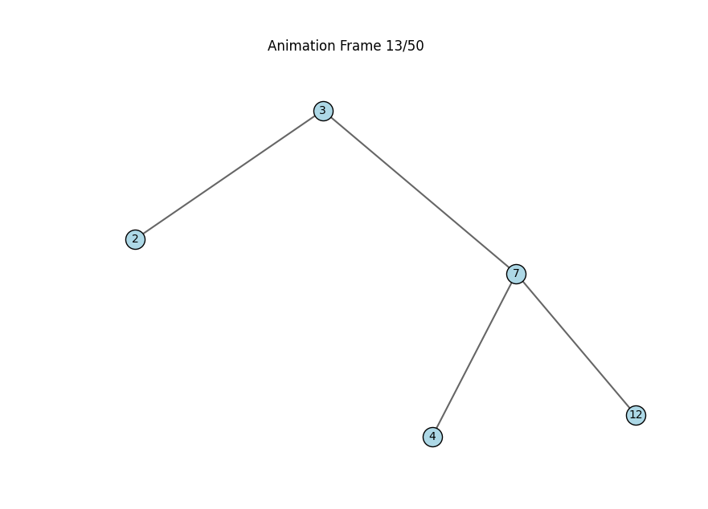

# TypeToGraph
TypeToGraph is an open-source library that converts type definitions into interactive graph visualizations, making it easier to explore and understand complex data structures.

---
# Features:
- Spring Layouts
- Unique Visualizations
- Simple type designed to be customized

---

# Installation

You can get started by cloning the repository:

```bash
git clone https://github.com/mileaage/TypeToGraph.git
cd TypeToGraph
```

# Example Usage

```python
    displayer = GraphDisplayer()
    my_tree = tree.BinaryTree(3)

    my_tree.insert(7)
    my_tree.insert(2)
    my_tree.insert(3)
    my_tree.insert(12)
    my_tree.insert(7)
    my_tree.insert(3)
    my_tree.insert(4)
    
    displayer.display(my_tree, 'BinaryTree', True)
```


# Documentation
## I haven't made any yet but here are the types implemented:
    - Binary Tree
    - Date based Tree
    - More coming soon or just contribute *wink*

## Layouts
    - Spring
    - Hierarchical
    - Circular
    - Force Directed